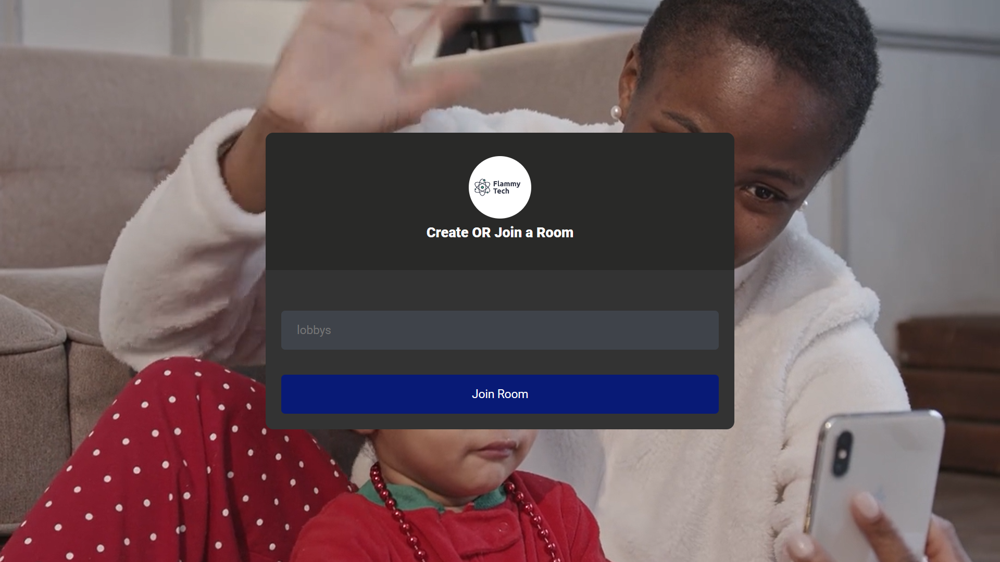
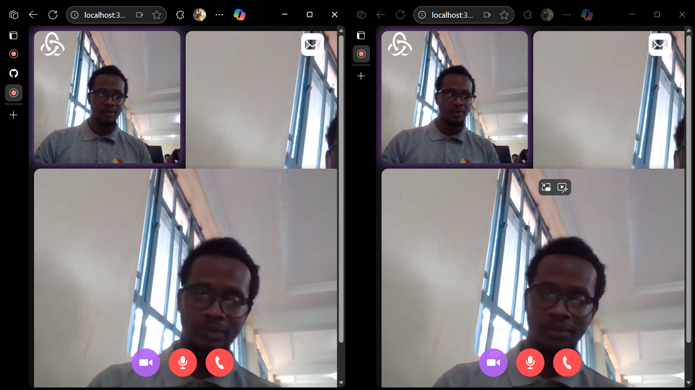

# Chat Mistique

A peer to peer WebRTC application with controls

# Installation

- 1 - clone repo
- 2 - yarn install or npm install
- 3 - In the root directory start the server

```bash
node server.js
```

# Video Calling Project

Welcome to the Video Calling Project! This repository contains the codebase for a robust and scalable video calling application. Our goal is to provide a seamless video communication experience with high-quality audio and video streaming, easy-to-use interface, and secure connections.

## Table of Contents

1. [Features](#features)
2. [Installation](#installation)
3. [Usage](#usage)
4. [Contributing](#contributing)
5. [License](#license)

## Features

- **High-Quality Video and Audio**: Enjoy crystal clear video and audio calls.
- **Multi-Party Conferencing**: Connect with multiple participants in a single call.
- **Screen Sharing**: Share your screen with others during the call.
- **Chat Functionality**: Send and receive messages in real-time.
- **End-to-End Encryption**: Secure your communications with robust encryption.




## Installation

Follow these steps to set up the project locally:

1. **Clone the Repository**

   ```bash
   git clone https://github.com/lewis-2000/ChatMistique.git

   ```

1. **Agora Account Configuration**

- Create an account on agora.io and create an app to generate an APP ID.

* Update APP ID, Temp Token and Channel Name in main.js

```javascript
let APP_ID = "YOU-APP-ID";
```
